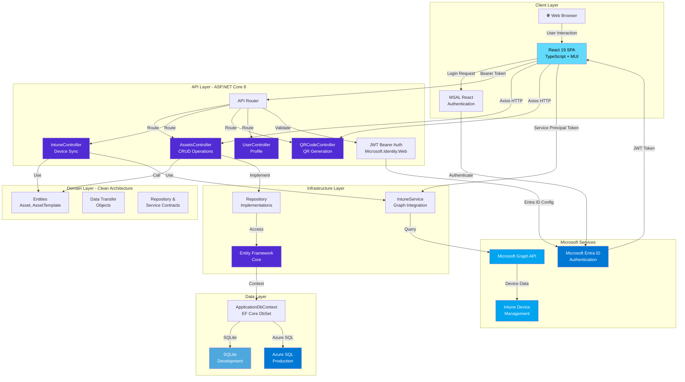
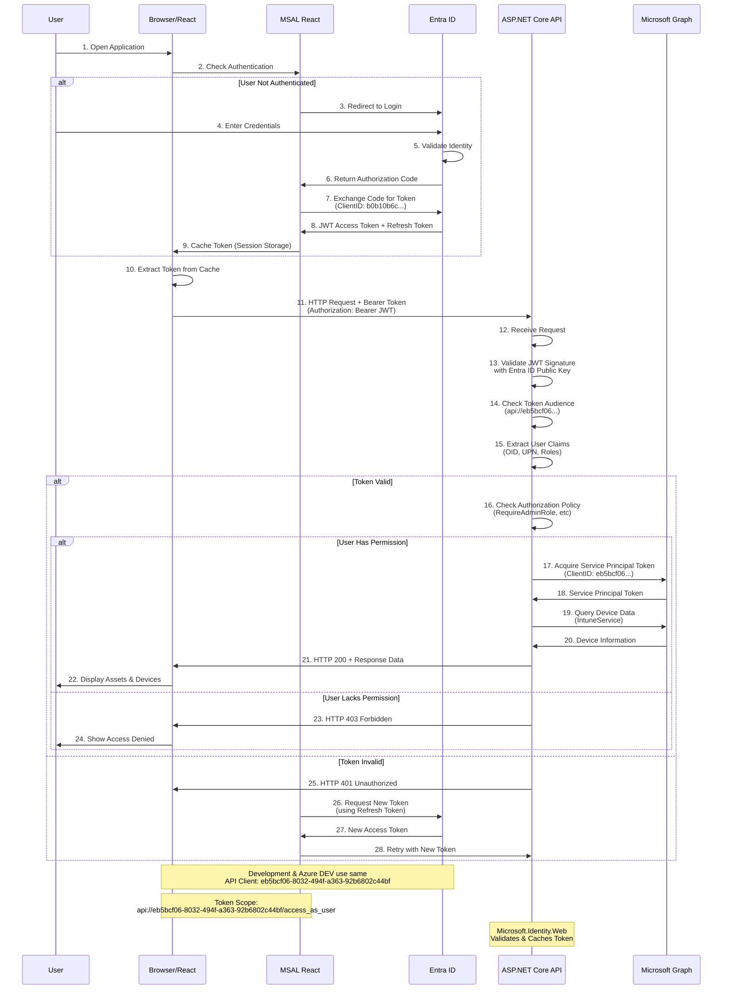
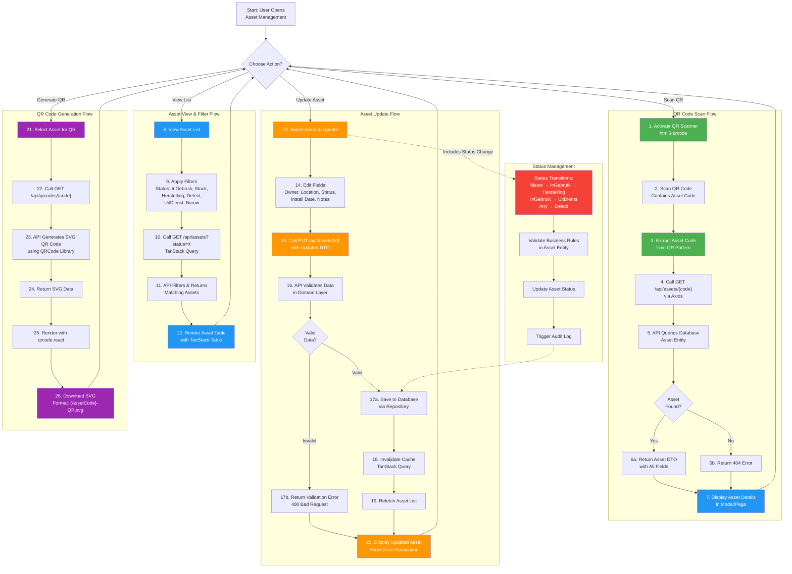

# Djoppie-Inventory System Diagrams

This document contains Mermaid diagrams illustrating the Djoppie-Inventory system architecture and key workflows.

---

## 1. System Architecture Diagram

Shows the complete layered architecture including frontend, backend, database, and external integrations.



**Key Components:**

- **Client Layer**: React SPA with MSAL for Microsoft authentication
- **Microsoft Services**: Entra ID for user authentication, Microsoft Graph for Intune device data
- **API Layer**: ASP.NET Core 8 with multiple controllers handling different domains
- **Domain Layer**: Clean Architecture with entities, DTOs, and repository interfaces
- **Infrastructure Layer**: EF Core, repository implementations, and Intune service
- **Data Layer**: Context-aware database selection (SQLite for dev, Azure SQL for prod)

---

## 2. Authentication Flow Diagram

Illustrates the complete authentication and token acquisition process.



**Key Steps:**

1. **User Login**: MSAL redirects to Entra ID for credential validation
2. **Token Acquisition**: Receive JWT access token with required scope
3. **API Request**: Include token in Authorization header
4. **Token Validation**: Backend validates signature, audience, and claims
5. **Authorization Check**: Verify user has required permissions
6. **Service Principal Token**: For downstream Microsoft Graph calls
7. **Data Retrieval**: Query Intune/Microsoft Graph with service principal
8. **Error Handling**: 401 triggers token refresh, 403 denies access

---

## 3. Asset Management Flow Diagram

Shows the complete workflow from QR code scanning to asset status updates.



**Key Workflows:**

1. **QR Scan**: Activate camera → Scan code → Look up asset → Display details
2. **List & Filter**: View all assets → Apply status filters → Display filtered results
3. **Update Asset**: Edit fields → Validate data → Save to DB → Refresh cache
4. **Generate QR**: Create SVG QR code → Render in UI → Allow download
5. **Status Management**: Validate transitions → Update status → Log changes

**Asset Status Values:**

- Nieuw (5) - New, not yet in use
- InGebruik (0) - In use
- Stock (1) - In inventory
- Herstelling (2) - Under repair
- Defect (3) - Broken/defective
- UitDienst (4) - Decommissioned

---

## 4. Rollout Planner Flow Diagram

Illustrates the workflow for planning and executing asset rollout campaigns.

```mermaid
graph TD
    A["Start: Open<br/>Rollout Planner"]
    B["1. Create New Session<br/>POST /api/rollout-sessions"]
    C["2. Configure Session<br/>Name, Department,<br/>Target Date, Budget"]
    D["3. Session Created<br/>Store in DB"]

    E["4. Add Days to Session<br/>Organize by Timeline"]
    F["5. For Each Day:<br/>Create Day Entity<br/>Link to Session"]

    G["6. Add Workplaces to Day<br/>Specify Locations<br/>e.g., Office A, Lab B"]
    H["7. For Each Workplace:<br/>Create Workplace Entity<br/>Link to Day"]

    I["8. Create Asset Plans<br/>for Each Workplace"]
    J["9. Define Required Assets<br/>Hardware, Software,<br/>Installation Instructions"]
    K["10. Link Asset Templates<br/>Quantity, Configuration"]

    L["11. View Rollout Timeline<br/>Gantt-style Visualization"]
    M["12. Check Resource<br/>Allocation & Conflicts"]

    N{"Ready to<br/>Execute?"}
    O["13. Mark Session<br/>as In Progress"]

    P["14. Execute Day:<br/>Check In Technicians"]
    Q["15. For Each Workplace:<br/>Scan Assets"]
    R["16. Update Asset Status<br/>InGebruik, Defect,<br/>Stock, Herstelling"]
    S["17. Record Installation<br/>Add Owner, Location,<br/>Installation Date"]

    T["18. Complete Workplace<br/>POST /api/workplaces/{id}/complete"]
    U["19. Mark Workplace<br/>as Completed"]
    V["20. Generate Report<br/>Assets Deployed<br/>Issues Encountered"]

    W["21. Complete Day:<br/>All Workplaces Done?"]
    X{"All Days<br/>Complete?"}
    Y["22. Close Session<br/>Mark as Completed"]
    Z["23. Generate Final Report<br/>Timeline, Cost, Issues"]

    AA["24. Reopen Completed<br/>Workplace if Needed<br/>POST /api/workplaces/{id}/reopen"]
    AB["Resume Execution<br/>at Step 14"]

    A --> B
    B --> C
    C --> D
    D --> E
    E --> F
    F --> G
    G --> H
    H --> I
    I --> J
    J --> K
    K --> L
    L --> M
    M --> N
    N -->|No| L
    N -->|Yes| O
    O --> P
    P --> Q
    Q --> R
    R --> S
    S --> T
    T --> U
    U --> V
    V --> W
    W -->|No| P
    W -->|Yes| X
    X -->|No| P
    X -->|Yes| Y
    Y --> Z
    Z --> AA
    AA --> AB
    AB --> T

    subgraph "Session Entity"
        SES["ID, Name, Department<br/>TargetDate, Status<br/>CreatedAt, CompletedAt"]
    end

    subgraph "Day Entity"
        DAY["ID, SessionID, SequenceNumber<br/>PlannedDate, Status<br/>Technicians Assigned"]
    end

    subgraph "Workplace Entity"
        WP["ID, DayID, Name, Location<br/>Status (Pending, InProgress,<br/>Completed), Issues"]
    end

    subgraph "Asset Plan Entity"
        AP["ID, WorkplaceID, AssetCode<br/>Quantity, ConfigNotes<br/>Deployed, Issues"]
    end

    B -.-> SES
    F -.-> DAY
    H -.-> WP
    J -.-> AP

    style B fill:#4CAF50,color:#fff
    style D fill:#4CAF50,color:#fff
    style O fill:#FF9800,color:#fff
    style P fill:#FF9800,color:#fff
    style T fill:#2196F3,color:#fff
    style U fill:#2196F3,color:#fff
    style Y fill:#9C27B0,color:#fff
    style AA fill:#F44336,color:#fff
    style AB fill:#F44336,color:#fff
```



**Rollout Process Stages:**

1. **Planning Phase** (Steps 1-12):
   - Create rollout session with metadata
   - Organize timeline by days
   - Assign workplaces to each day
   - Plan required assets and configurations
   - Review timeline and resources

2. **Execution Phase** (Steps 13-21):
   - Mark session as in progress
   - For each day/workplace:
     - Scan and deploy assets
     - Update asset status and ownership
     - Record installation metadata
     - Mark workplace complete
   - Generate daily reports

3. **Completion Phase** (Steps 22-23):
   - Close session when all workplaces done
   - Generate final rollout report

4. **Adjustment Phase** (Steps 24-26):
   - Reopen completed workplaces if issues found
   - Resume execution from appropriate step
   - Update asset status/configuration as needed

**Data Model Relationships:**

```text
Session (1) ──→ (N) Days
Day     (1) ──→ (N) Workplaces
Workplace (1) ──→ (N) Asset Plans
Asset Plan ──→ Asset (via AssetCode)
```

---

## Diagram Export & Integration

### Using These Diagrams

1. **In Markdown Files**: Copy the Mermaid code block directly into `.md` files
2. **In GitHub**: Diagrams render automatically in README and documentation
3. **In GitHub Pages**: Use Mermaid CDN for static site rendering
4. **In Azure DevOps Wiki**: Support may vary; test before using

### Styling & Customization

To customize colors or fonts, modify the `style` statements:

```mermaid
style NodeName fill:#hexColor,color:#textColor,stroke:#borderColor,stroke-width:2px
```

Common colors used:

- React: `#61dafb` (cyan)
- Microsoft: `#0078d4` (blue), `#00a4ef` (light blue)
- ASP.NET: `#512bd4` (purple)
- Status/Success: `#4CAF50` (green)
- Info: `#2196F3` (blue)
- Warning: `#FF9800` (orange)
- Error: `#F44336` (red)

### Accessibility

- All diagrams include labels and descriptions
- Use contrasting colors for readability
- Font sizes automatically scale
- Text alternatives provided in narrative descriptions

---

## Related Documentation

- **CLAUDE.md** - Project overview and development guide
- **README.md** - User guide (Dutch)
- **docs/BACKEND-CONFIGURATION-GUIDE.md** - API configuration details
- **PRODUCTION-DEPLOYMENT-GUIDE.md** - Deployment procedures
- **KEYVAULT-QUICK-REFERENCE.md** - Secret management reference

Last updated: 2026-03-11
