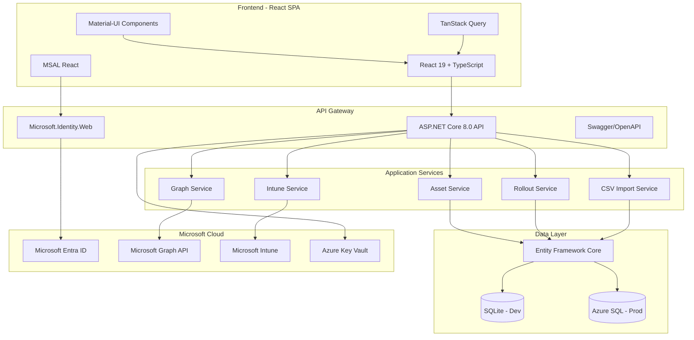
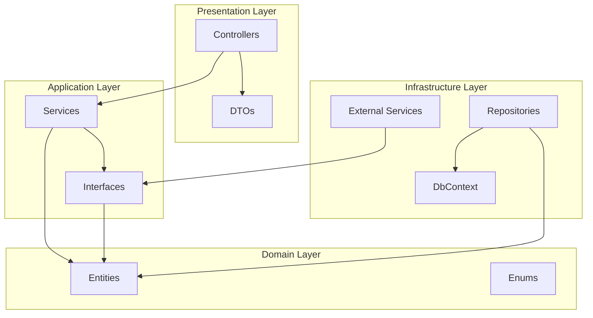
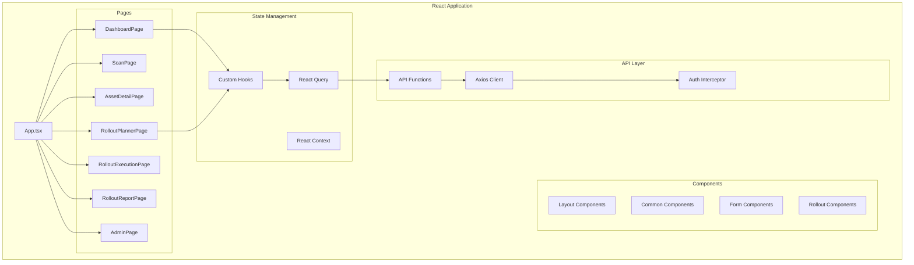
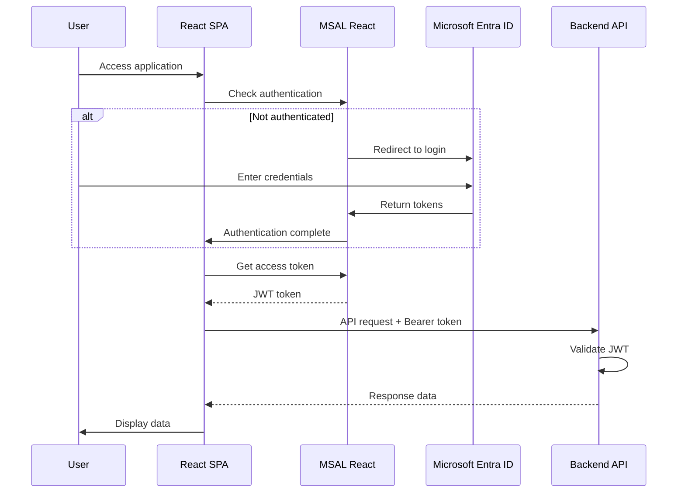
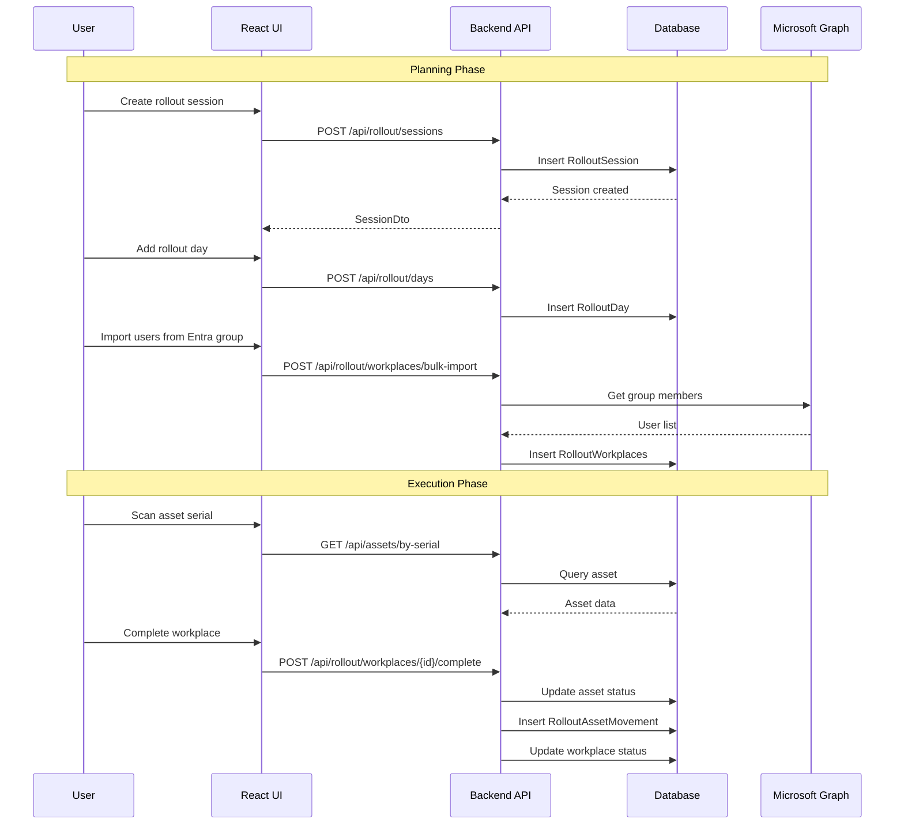
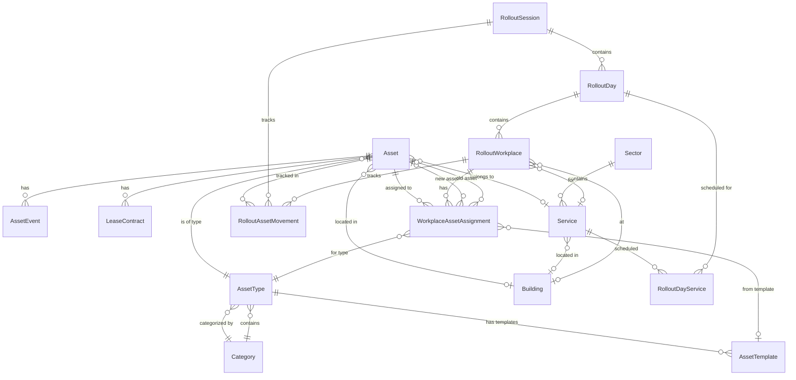
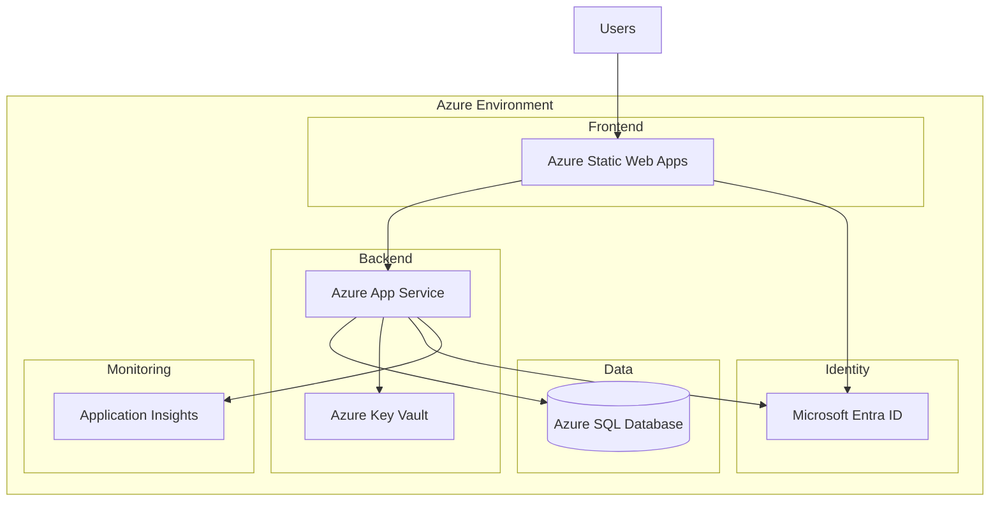

# Djoppie Inventory - System Architecture

## Overview

Djoppie Inventory is an enterprise IT asset management system built with a clean architecture approach, featuring React frontend, ASP.NET Core backend, and Microsoft cloud integrations.

---

## System Architecture Diagram



---

## Clean Architecture Layers



### Layer Responsibilities

| Layer | Project | Responsibility |
|-------|---------|----------------|
| **Presentation** | DjoppieInventory.API | HTTP endpoints, request/response handling, authentication |
| **Domain** | DjoppieInventory.Core | Entities, enums, DTOs, interface contracts |
| **Infrastructure** | DjoppieInventory.Infrastructure | Data access, external service integrations, implementations |

---

## Backend Project Structure

```
src/backend/
├── DjoppieInventory.API/           # Presentation Layer
│   ├── Controllers/
│   │   ├── AssetsController.cs
│   │   ├── AssetEventsController.cs
│   │   ├── AssetTemplatesController.cs
│   │   ├── AssetTypesController.cs
│   │   ├── BuildingsController.cs
│   │   ├── CategoriesController.cs
│   │   ├── CsvImportController.cs
│   │   ├── GraphController.cs
│   │   ├── IntuneController.cs
│   │   ├── LeaseContractsController.cs
│   │   ├── QRCodeController.cs
│   │   ├── RolloutsController.cs
│   │   ├── RolloutDaysController.cs
│   │   ├── RolloutReportsController.cs
│   │   ├── RolloutSessionsController.cs
│   │   ├── RolloutWorkplacesController.cs
│   │   ├── SectorsController.cs
│   │   ├── ServicesController.cs
│   │   └── UserController.cs
│   ├── Program.cs                  # Application entry & DI setup
│   └── appsettings.*.json
│
├── DjoppieInventory.Core/          # Domain Layer
│   ├── Entities/
│   │   ├── Asset.cs
│   │   ├── AssetEvent.cs
│   │   ├── AssetTemplate.cs
│   │   ├── AssetType.cs
│   │   ├── Building.cs
│   │   ├── Category.cs
│   │   ├── LeaseContract.cs
│   │   ├── RolloutAssetMovement.cs
│   │   ├── RolloutDay.cs
│   │   ├── RolloutDayService.cs
│   │   ├── RolloutSession.cs
│   │   ├── RolloutWorkplace.cs
│   │   ├── Sector.cs
│   │   ├── Service.cs
│   │   └── WorkplaceAssetAssignment.cs
│   ├── Entities/Enums/
│   │   ├── AssetStatus.cs
│   │   ├── AssetEventType.cs
│   │   ├── LeaseStatus.cs
│   │   ├── RolloutSessionStatus.cs
│   │   ├── RolloutDayStatus.cs
│   │   ├── RolloutWorkplaceStatus.cs
│   │   ├── AssignmentCategory.cs
│   │   ├── AssetSourceType.cs
│   │   ├── AssetAssignmentStatus.cs
│   │   ├── MovementType.cs
│   │   └── EntraSyncStatus.cs
│   ├── DTOs/
│   │   └── [40+ DTO classes]
│   └── Interfaces/
│       └── [Service interfaces]
│
└── DjoppieInventory.Infrastructure/ # Infrastructure Layer
    ├── Data/
    │   └── ApplicationDbContext.cs
    ├── Repositories/
    │   └── [Repository implementations]
    └── Services/
        ├── AssetService.cs
        ├── AssetCodeGeneratorService.cs
        ├── AssetEventService.cs
        ├── AssetMovementService.cs
        ├── CsvImportService.cs
        ├── GraphUserService.cs
        ├── IntuneService.cs
        ├── OrganizationSyncService.cs
        ├── RolloutWorkplaceService.cs
        └── WorkplaceAssetAssignmentService.cs
```

---

## Frontend Architecture



### Frontend Project Structure

```
src/frontend/
├── src/
│   ├── api/                    # API client layer
│   │   ├── client.ts           # Axios instance
│   │   ├── authInterceptor.ts  # MSAL token injection
│   │   ├── assets.api.ts
│   │   ├── rollout.api.ts
│   │   ├── intune.api.ts
│   │   ├── graph.api.ts
│   │   └── [other API files]
│   │
│   ├── components/             # Reusable components
│   │   ├── layout/
│   │   ├── common/
│   │   ├── assets/
│   │   ├── rollout/
│   │   ├── scanner/
│   │   ├── admin/
│   │   └── print/
│   │
│   ├── pages/                  # Page components
│   │   ├── DashboardPage.tsx
│   │   ├── ScanPage.tsx
│   │   ├── AssetDetailPage.tsx
│   │   ├── RolloutPlannerPage.tsx
│   │   ├── RolloutExecutionPage.tsx
│   │   ├── RolloutReportPage.tsx
│   │   └── AdminPage.tsx
│   │
│   ├── hooks/                  # Custom React hooks
│   │   ├── useAssets.ts
│   │   ├── useRollout.ts
│   │   ├── useAuth.ts
│   │   └── rollout/
│   │
│   ├── types/                  # TypeScript definitions
│   ├── config/                 # MSAL & app configuration
│   ├── utils/                  # Helper functions
│   ├── constants/              # App constants
│   └── i18n/                   # Translations (nl/en)
│
├── .env.development
├── .env.production
├── package.json
└── vite.config.ts
```

---

## Authentication Flow



### Authentication Configuration

**Frontend (MSAL):**
- Client ID: `b0b10b6c-8638-4bdd-9684-de4a55afd521`
- Authority: `https://login.microsoftonline.com/{tenant-id}`
- Scope: `api://eb5bcf06-8032-494f-a363-92b6802c44bf/access_as_user`

**Backend (Microsoft.Identity.Web):**
- Client ID: `eb5bcf06-8032-494f-a363-92b6802c44bf`
- Audience: `api://eb5bcf06-8032-494f-a363-92b6802c44bf`

---

## Data Flow - Rollout Workflow



---

## Database Schema Overview



---

## Key Design Patterns

### 1. Repository Pattern
```csharp
// Interface in Core layer
public interface IAssetRepository
{
    Task<Asset?> GetByIdAsync(int id);
    Task<Asset?> GetByCodeAsync(string code);
    Task<PagedResult<Asset>> GetPagedAsync(AssetFilter filter);
}

// Implementation in Infrastructure layer
public class AssetRepository : IAssetRepository
{
    private readonly ApplicationDbContext _context;
    // Implementation details
}
```

### 2. DTO Pattern
```csharp
// Entity (Domain)
public class Asset
{
    public int Id { get; set; }
    public string AssetCode { get; set; }
    // ... many properties and relationships
}

// DTO (Presentation)
public class AssetDto
{
    public int Id { get; set; }
    public string AssetCode { get; set; }
    public string AssetTypeName { get; set; } // Flattened
    // Only properties needed by client
}
```

### 3. Service Layer Pattern
```csharp
public class AssetMovementService : IAssetMovementService
{
    public async Task<RolloutAssetMovement> RecordDeploymentAsync(
        AssetDeploymentRequest request,
        string performedBy,
        string performedByEmail)
    {
        // Business logic for recording deployment
        // Updates asset status
        // Creates audit trail
    }
}
```

### 4. React Query for Server State
```typescript
// Custom hook using React Query
export function useAssets(filter: AssetFilter) {
    return useQuery({
        queryKey: ['assets', filter],
        queryFn: () => assetsApi.getAssets(filter),
        staleTime: 5 * 60 * 1000, // 5 minutes
    });
}

// Usage in component
const { data, isLoading, error } = useAssets({ status: 'InGebruik' });
```

---

## Deployment Architecture



### Environment Configuration

| Environment | Frontend | Backend | Database |
|-------------|----------|---------|----------|
| Development | localhost:5173 | localhost:5052 | SQLite |
| Azure DEV | Static Web App | App Service | Azure SQL |
| Production | Static Web App | App Service | Azure SQL |

---

## Security Architecture

### Authentication & Authorization
- **Identity Provider**: Microsoft Entra ID
- **Token Type**: JWT Bearer tokens
- **Token Validation**: Microsoft.Identity.Web
- **Authorization**: Role-based via Entra ID groups

### API Security
- All endpoints require authentication (except health checks)
- CORS configured for known frontend origins
- Input validation on all endpoints
- Parameterized queries via EF Core

### Secret Management
- **Development**: .NET User Secrets
- **Production**: Azure Key Vault
- **Configuration**: Key Vault references in App Settings

---

## Performance Considerations

### Backend
- Pagination for large datasets
- Async/await throughout
- EF Core query optimization
- Response caching for static data

### Frontend
- React Query caching
- Code splitting with React.lazy
- Optimistic updates for mutations
- Virtualized lists for large datasets

---

## Scalability

The architecture supports horizontal scaling:

1. **Stateless API**: No server-side session state
2. **Database Connection Pooling**: EF Core connection management
3. **CDN for Static Assets**: Azure Static Web Apps CDN
4. **Caching**: React Query client-side, potential Redis server-side

---

## Integration Points

| System | Integration Method | Purpose |
|--------|-------------------|---------|
| Microsoft Entra ID | MSAL / Microsoft.Identity.Web | Authentication |
| Microsoft Graph | Graph SDK | User/group data |
| Microsoft Intune | Graph SDK | Device management |
| Azure Key Vault | Azure SDK | Secret management |
| Application Insights | SDK | Telemetry & monitoring |
