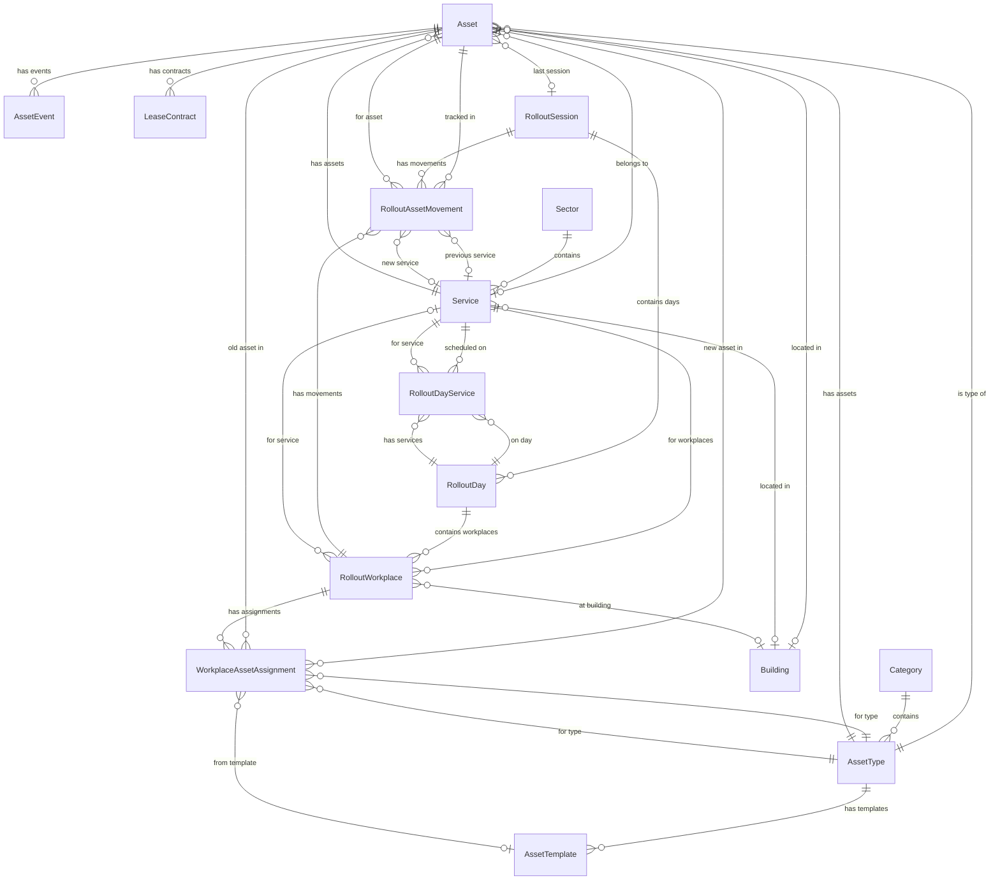

# Djoppie Inventory - Data Model Reference

## Overview

This document provides a comprehensive reference for all domain entities, enumerations, and their relationships in the Djoppie Inventory system.

---

## Entity Relationship Diagram



---

## Core Entities

### Asset

The central entity representing IT equipment in the inventory system.

**File:** `DjoppieInventory.Core/Entities/Asset.cs`

| Property | Type | Required | Description |
|----------|------|----------|-------------|
| Id | int | Yes | Primary key |
| AssetCode | string | Yes | Auto-generated code (e.g., LAP-25-DBK-00001) |
| AssetName | string | Yes | Device name, typically from Intune |
| Alias | string | No | User-friendly name or alias |
| Category | string | Yes | Category (Computing, Peripherals, etc.) |
| IsDummy | bool | Yes | Test asset flag (codes 9000+) |
| LegacyBuilding | string | No | [LEGACY] Free-text building |
| Owner | string | No | Assigned user name |
| LegacyDepartment | string | No | [LEGACY] Free-text department |
| JobTitle | string | No | Owner's job title |
| OfficeLocation | string | No | Owner's office location |
| Status | AssetStatus | Yes | Current status (default: Stock) |
| Brand | string | No | Manufacturer |
| Model | string | No | Model number |
| SerialNumber | string | No | Unique serial number |
| PurchaseDate | DateTime | No | Purchase date |
| WarrantyExpiry | DateTime | No | Warranty end date |
| InstallationDate | DateTime | No | Deployment date |
| CreatedAt | DateTime | Yes | Record creation timestamp |
| UpdatedAt | DateTime | Yes | Last update timestamp |
| AssetTypeId | int | No | FK to AssetType |
| ServiceId | int | No | FK to Service |
| InstallationLocation | string | No | Specific location within building |
| CurrentWorkplaceAssignmentId | int | No | FK to current assignment |
| LastRolloutSessionId | int | No | FK to last rollout session |
| BuildingId | int | No | FK to Building |

**Navigation Properties:**
- `AssetType` - The asset type classification
- `Service` - Assigned department
- `Building` - Physical location
- `Events` - Historical events (audit trail)
- `LeaseContracts` - Lease agreements
- `CurrentWorkplaceAssignment` - Active rollout assignment
- `LastRolloutSession` - Most recent rollout
- `AssetMovements` - Movement history

---

### AssetType

Defines types/categories of assets for classification and code generation.

**File:** `DjoppieInventory.Core/Entities/AssetType.cs`

| Property | Type | Required | Description |
|----------|------|----------|-------------|
| Id | int | Yes | Primary key |
| Code | string | Yes | Short code (2-4 chars, e.g., LAP, MON) |
| Name | string | Yes | Display name (e.g., Laptop, Monitor) |
| Description | string | No | Detailed description |
| IsActive | bool | Yes | Active status (soft delete) |
| SortOrder | int | Yes | UI display order |
| CategoryId | int | No | FK to Category |
| CreatedAt | DateTime | Yes | Record creation timestamp |
| UpdatedAt | DateTime | No | Last update timestamp |

**Code Examples:**
- `LAP` - Laptop
- `DESK` - Desktop
- `MON` - Monitor
- `TAB` - Tablet
- `PRN` - Printer
- `TEL` - Telephone
- `NET` - Network equipment

---

### Category

Groups asset types into broader categories.

**File:** `DjoppieInventory.Core/Entities/Category.cs`

| Property | Type | Required | Description |
|----------|------|----------|-------------|
| Id | int | Yes | Primary key |
| Name | string | Yes | Category name |
| Description | string | No | Description |
| IsActive | bool | Yes | Active status |
| SortOrder | int | Yes | UI display order |

---

### AssetTemplate

Predefined configurations for quick asset creation.

**File:** `DjoppieInventory.Core/Entities/AssetTemplate.cs`

| Property | Type | Required | Description |
|----------|------|----------|-------------|
| Id | int | Yes | Primary key |
| TemplateName | string | Yes | Template name |
| AssetName | string | Yes | Default asset name |
| Category | string | Yes | Asset category |
| AssetTypeId | int | Yes | FK to AssetType |
| Brand | string | No | Default brand |
| Model | string | No | Default model |
| IsActive | bool | Yes | Active status |

---

### AssetEvent

Audit trail for asset lifecycle changes.

**File:** `DjoppieInventory.Core/Entities/AssetEvent.cs`

| Property | Type | Required | Description |
|----------|------|----------|-------------|
| Id | int | Yes | Primary key |
| AssetId | int | Yes | FK to Asset |
| EventType | AssetEventType | Yes | Type of event |
| Description | string | Yes | Event description |
| Notes | string | No | Additional notes |
| OldValue | string | No | Previous value (before change) |
| NewValue | string | No | New value (after change) |
| PerformedBy | string | No | User who performed action |
| PerformedByEmail | string | No | User's email |
| EventDate | DateTime | Yes | When event occurred |
| CreatedAt | DateTime | Yes | Record creation timestamp |

---

### LeaseContract

Tracks leasing and warranty information for assets.

**File:** `DjoppieInventory.Core/Entities/LeaseContract.cs`

| Property | Type | Required | Description |
|----------|------|----------|-------------|
| Id | int | Yes | Primary key |
| AssetId | int | Yes | FK to Asset |
| ContractNumber | string | No | External contract reference |
| Vendor | string | No | Leasing company |
| StartDate | DateTime | Yes | Contract start |
| EndDate | DateTime | Yes | Contract end |
| MonthlyRate | decimal | No | Monthly payment |
| TotalValue | decimal | No | Total contract value |
| Status | LeaseStatus | Yes | Contract status |
| Notes | string | No | Additional notes |
| CreatedAt | DateTime | Yes | Record creation timestamp |
| UpdatedAt | DateTime | No | Last update timestamp |

---

## Organization Entities

### Sector

Top-level organizational division.

**File:** `DjoppieInventory.Core/Entities/Sector.cs`

| Property | Type | Required | Description |
|----------|------|----------|-------------|
| Id | int | Yes | Primary key |
| Code | string | Yes | Short code (e.g., ORG, RUI, ZOR) |
| Name | string | Yes | Full name |
| IsActive | bool | Yes | Active status |
| SortOrder | int | Yes | UI display order |
| CreatedAt | DateTime | Yes | Record creation timestamp |
| UpdatedAt | DateTime | No | Last update timestamp |
| **Entra Integration** |||
| EntraGroupId | string | No | Microsoft Entra group GUID |
| EntraMailNickname | string | No | Group mail alias |
| EntraSyncEnabled | bool | Yes | Sync enabled flag |
| EntraLastSyncAt | DateTime | No | Last sync timestamp |
| EntraSyncStatus | EntraSyncStatus | Yes | Sync status |
| EntraSyncError | string | No | Last sync error message |
| ManagerEntraId | string | No | Manager's Entra ID |
| ManagerDisplayName | string | No | Manager's display name |
| ManagerEmail | string | No | Manager's email |

---

### Service

Department or team within a sector.

**File:** `DjoppieInventory.Core/Entities/Service.cs`

| Property | Type | Required | Description |
|----------|------|----------|-------------|
| Id | int | Yes | Primary key |
| SectorId | int | No | FK to parent Sector |
| Code | string | Yes | Code matching Entra MG- groups |
| Name | string | Yes | Full service name |
| IsActive | bool | Yes | Active status |
| SortOrder | int | Yes | UI display order |
| CreatedAt | DateTime | Yes | Record creation timestamp |
| UpdatedAt | DateTime | No | Last update timestamp |
| BuildingId | int | No | FK to primary Building |
| **Entra Integration** |||
| EntraGroupId | string | No | Microsoft Entra group GUID |
| EntraMailNickname | string | No | Group mail alias |
| EntraSyncEnabled | bool | Yes | Sync enabled flag |
| EntraLastSyncAt | DateTime | No | Last sync timestamp |
| EntraSyncStatus | EntraSyncStatus | Yes | Sync status |
| EntraSyncError | string | No | Last sync error message |
| ManagerEntraId | string | No | Manager's Entra ID |
| ManagerDisplayName | string | No | Manager's display name |
| ManagerEmail | string | No | Manager's email |
| MemberCount | int | Yes | Cached member count |

---

### Building

Physical location where assets are installed.

**File:** `DjoppieInventory.Core/Entities/Building.cs`

| Property | Type | Required | Description |
|----------|------|----------|-------------|
| Id | int | Yes | Primary key |
| Code | string | Yes | Short code (e.g., DBK, WZC) |
| Name | string | Yes | Full building name |
| Address | string | No | Physical address |
| IsActive | bool | Yes | Active status |
| SortOrder | int | Yes | UI display order |
| CreatedAt | DateTime | Yes | Record creation timestamp |
| UpdatedAt | DateTime | No | Last update timestamp |

**Code Examples:**
- `DBK` - Gemeentehuis Diepenbeek
- `WZC` - WZC De Visserij
- `GBS` - Gemeentelijke Basisschool
- `BIB` - Bibliotheek

---

## Rollout Entities

### RolloutSession

Container for a rollout campaign spanning multiple days.

**File:** `DjoppieInventory.Core/Entities/RolloutSession.cs`

| Property | Type | Required | Description |
|----------|------|----------|-------------|
| Id | int | Yes | Primary key |
| SessionName | string | Yes | Session name (e.g., "Q1 2026 Rollout") |
| Description | string | No | Purpose and scope |
| Status | RolloutSessionStatus | Yes | Current status |
| PlannedStartDate | DateTime | Yes | Planned start |
| PlannedEndDate | DateTime | No | Planned end |
| StartedAt | DateTime | No | Actual start timestamp |
| CompletedAt | DateTime | No | Actual completion timestamp |
| CreatedBy | string | Yes | Creator's display name |
| CreatedByEmail | string | Yes | Creator's email |
| CreatedAt | DateTime | Yes | Record creation timestamp |
| UpdatedAt | DateTime | Yes | Last update timestamp |

**Navigation Properties:**
- `Days` - Collection of RolloutDay
- `AssetMovements` - All movements in this session

---

### RolloutDay

A specific day within a rollout session.

**File:** `DjoppieInventory.Core/Entities/RolloutDay.cs`

| Property | Type | Required | Description |
|----------|------|----------|-------------|
| Id | int | Yes | Primary key |
| RolloutSessionId | int | Yes | FK to parent session |
| Date | DateTime | Yes | The specific date |
| Name | string | No | Display name |
| DayNumber | int | Yes | Sequential number (1, 2, 3...) |
| ScheduledServiceIds | string | No | [LEGACY] Comma-separated service IDs |
| TotalWorkplaces | int | Yes | Count of workplaces |
| CompletedWorkplaces | int | Yes | Completed count |
| Status | RolloutDayStatus | Yes | Day status |
| Notes | string | No | Additional notes |
| CreatedAt | DateTime | Yes | Record creation timestamp |
| UpdatedAt | DateTime | Yes | Last update timestamp |

**Navigation Properties:**
- `RolloutSession` - Parent session
- `Workplaces` - Collection of RolloutWorkplace
- `ScheduledServices` - Collection of RolloutDayService

---

### RolloutDayService

Junction table linking days to scheduled services.

**File:** `DjoppieInventory.Core/Entities/RolloutDayService.cs`

| Property | Type | Required | Description |
|----------|------|----------|-------------|
| Id | int | Yes | Primary key |
| RolloutDayId | int | Yes | FK to RolloutDay |
| ServiceId | int | Yes | FK to Service |

---

### RolloutWorkplace

Individual user workplace setup within a rollout day.

**File:** `DjoppieInventory.Core/Entities/RolloutWorkplace.cs`

| Property | Type | Required | Description |
|----------|------|----------|-------------|
| Id | int | Yes | Primary key |
| RolloutDayId | int | Yes | FK to parent day |
| UserName | string | Yes | User's display name |
| UserEmail | string | No | User's email |
| Location | string | No | Physical location/office |
| ScheduledDate | DateTime | No | Custom override date |
| ServiceId | int | No | FK to Service |
| UserEntraId | string | No | Microsoft Entra user ID |
| BuildingId | int | No | FK to Building |
| IsLaptopSetup | bool | Yes | Laptop vs desktop flag |
| AssetPlansJson | string | Yes | [LEGACY] JSON asset plans |
| Status | RolloutWorkplaceStatus | Yes | Execution status |
| TotalItems | int | Yes | Planned asset count |
| CompletedItems | int | Yes | Completed asset count |
| CompletedAt | DateTime | No | Completion timestamp |
| CompletedBy | string | No | Technician name |
| CompletedByEmail | string | No | Technician email |
| Notes | string | No | Additional notes |
| MovedToWorkplaceId | int | No | FK if rescheduled (to) |
| MovedFromWorkplaceId | int | No | FK if rescheduled (from) |
| CreatedAt | DateTime | Yes | Record creation timestamp |
| UpdatedAt | DateTime | Yes | Last update timestamp |

**Navigation Properties:**
- `RolloutDay` - Parent day
- `Service` - Associated service
- `Building` - Physical location
- `AssetAssignments` - Collection of WorkplaceAssetAssignment
- `AssetMovements` - Movement records

---

### WorkplaceAssetAssignment

Individual asset assignment within a workplace (replaces JSON-based AssetPlansJson).

**File:** `DjoppieInventory.Core/Entities/WorkplaceAssetAssignment.cs`

| Property | Type | Required | Description |
|----------|------|----------|-------------|
| Id | int | Yes | Primary key |
| RolloutWorkplaceId | int | Yes | FK to workplace |
| AssetTypeId | int | Yes | FK to AssetType |
| AssignmentCategory | AssignmentCategory | Yes | User vs workplace-fixed |
| SourceType | AssetSourceType | Yes | How asset is provisioned |
| NewAssetId | int | No | FK to new asset |
| OldAssetId | int | No | FK to old asset being replaced |
| AssetTemplateId | int | No | FK to template |
| Position | int | Yes | Slot order (1, 2, 3...) |
| SerialNumberRequired | bool | Yes | Serial capture required |
| QRCodeRequired | bool | Yes | QR scan required |
| SerialNumberCaptured | string | No | Captured serial |
| Status | AssetAssignmentStatus | Yes | Execution status |
| InstalledAt | DateTime | No | Installation timestamp |
| InstalledBy | string | No | Technician name |
| InstalledByEmail | string | No | Technician email |
| Notes | string | No | Additional notes |
| MetadataJson | string | No | Extra metadata (JSON) |
| CreatedAt | DateTime | Yes | Record creation timestamp |
| UpdatedAt | DateTime | Yes | Last update timestamp |

**Navigation Properties:**
- `RolloutWorkplace` - Parent workplace
- `AssetType` - Equipment type
- `NewAsset` - Deployed asset
- `OldAsset` - Replaced asset
- `AssetTemplate` - Creation template

---

### RolloutAssetMovement

Immutable audit record of asset movements during rollout execution.

**File:** `DjoppieInventory.Core/Entities/RolloutAssetMovement.cs`

| Property | Type | Required | Description |
|----------|------|----------|-------------|
| Id | int | Yes | Primary key |
| RolloutSessionId | int | Yes | FK to session |
| RolloutWorkplaceId | int | No | FK to workplace |
| WorkplaceAssetAssignmentId | int | No | FK to assignment |
| AssetId | int | Yes | FK to asset |
| MovementType | MovementType | Yes | Type of movement |
| PreviousStatus | AssetStatus | No | Status before |
| NewStatus | AssetStatus | Yes | Status after |
| PreviousOwner | string | No | Previous owner |
| NewOwner | string | No | New owner |
| PreviousServiceId | int | No | Previous service FK |
| NewServiceId | int | No | New service FK |
| PreviousLocation | string | No | Previous location |
| NewLocation | string | No | New location |
| SerialNumber | string | No | Cached serial number |
| PerformedBy | string | Yes | Technician name |
| PerformedByEmail | string | Yes | Technician email |
| PerformedAt | DateTime | Yes | Movement timestamp |
| Notes | string | No | Additional notes |
| CreatedAt | DateTime | Yes | Record creation timestamp |

---

## Enumerations

### AssetStatus

Operational status of an asset.

**File:** `DjoppieInventory.Core/Entities/Asset.cs:198`

| Value | Int | Description |
|-------|-----|-------------|
| InGebruik | 0 | In use - actively assigned to user |
| Stock | 1 | In stock - available for assignment |
| Herstelling | 2 | Under repair/maintenance |
| Defect | 3 | Broken/defective |
| UitDienst | 4 | Decommissioned/retired |
| Nieuw | 5 | New - in inventory but not deployed |

**Status Transitions:**
```
Nieuw → InGebruik (deployment)
Stock → InGebruik (deployment)
InGebruik → Stock (return)
InGebruik → Herstelling (repair)
Herstelling → InGebruik (repaired)
Herstelling → Defect (unrepairable)
InGebruik → UitDienst (decommission)
Defect → UitDienst (disposal)
```

---

### AssetEventType

Types of events recorded in asset history.

**File:** `DjoppieInventory.Core/Entities/AssetEvent.cs:6`

| Value | Int | Description |
|-------|-----|-------------|
| Created | 0 | Asset created in system |
| StatusChanged | 1 | Status changed |
| OwnerChanged | 2 | Owner/user changed |
| LocationChanged | 3 | Location/building changed |
| LeaseStarted | 4 | Lease contract started |
| LeaseEnded | 5 | Lease contract ended |
| Maintenance | 6 | Maintenance performed |
| Note | 7 | General note added |
| Other | 99 | Other event type |

---

### LeaseStatus

Status of lease contracts.

**File:** `DjoppieInventory.Core/Entities/LeaseContract.cs:6`

| Value | Int | Description |
|-------|-----|-------------|
| Active | 0 | Currently active |
| Expiring | 1 | Within 90 days of end |
| Expired | 2 | Past end date |
| Terminated | 3 | Terminated early |
| Renewed | 4 | Renewed with new contract |

---

### RolloutSessionStatus

Status of rollout sessions.

**File:** `DjoppieInventory.Core/Entities/RolloutSession.cs:6`

| Value | Int | Description |
|-------|-----|-------------|
| Planning | 0 | Being prepared |
| Ready | 1 | Finalized, ready to start |
| InProgress | 2 | Currently executing |
| Completed | 3 | All workplaces processed |
| Cancelled | 4 | Cancelled before completion |

---

### RolloutDayStatus

Status of rollout days.

**File:** `DjoppieInventory.Core/Entities/RolloutDay.cs:6`

| Value | Int | Description |
|-------|-----|-------------|
| Planning | 0 | Being prepared |
| Ready | 1 | Finalized for execution |
| Completed | 2 | All workplaces done |

---

### RolloutWorkplaceStatus

Status of individual workplace setups.

**File:** `DjoppieInventory.Core/Entities/RolloutWorkplace.cs:6`

| Value | Int | Description |
|-------|-----|-------------|
| Pending | 0 | Waiting to be configured |
| InProgress | 1 | Configuration in progress |
| Completed | 2 | Fully configured |
| Skipped | 3 | Intentionally skipped |
| Failed | 4 | Configuration failed |
| Ready | 5 | Fully configured, ready for execution |

---

### AssignmentCategory

Category of asset assignment.

**File:** `DjoppieInventory.Core/Entities/Enums/AssignmentCategory.cs`

| Value | Int | Description |
|-------|-----|-------------|
| UserAssigned | 0 | Follows the user (e.g., laptop) |
| WorkplaceFixed | 1 | Stays at location (e.g., monitor) |

---

### AssetSourceType

Source of asset provisioning.

**File:** `DjoppieInventory.Core/Entities/Enums/AssetSourceType.cs`

| Value | Int | Description |
|-------|-----|-------------|
| ExistingInventory | 0 | Picked from existing stock |
| NewFromTemplate | 1 | Created from template |
| CreateOnSite | 2 | Created during execution |

---

### AssetAssignmentStatus

Execution status of asset assignments.

**File:** `DjoppieInventory.Core/Entities/Enums/AssetAssignmentStatus.cs`

| Value | Int | Description |
|-------|-----|-------------|
| Pending | 0 | Not yet executed |
| Installed | 1 | Successfully installed |
| Skipped | 2 | Intentionally skipped |
| Failed | 3 | Installation failed |

---

### MovementType

Type of asset movement.

**File:** `DjoppieInventory.Core/Entities/Enums/MovementType.cs`

| Value | Int | Description |
|-------|-----|-------------|
| Deployed | 0 | Deployed to user/workplace |
| Decommissioned | 1 | Removed from service |
| Transferred | 2 | Moved between users/locations |

---

### EntraSyncStatus

Status of Microsoft Entra synchronization.

**File:** `DjoppieInventory.Core/Entities/Enums/EntraSyncStatus.cs`

| Value | Description |
|-------|-------------|
| None | Never synced |
| Success | Last sync successful |
| Failed | Last sync failed |
| InProgress | Sync in progress |

---

## Asset Code Format

Asset codes follow a structured format: `{TYPE}-{YY}-{BUILDING}-{SEQUENCE}`

**Components:**
- `TYPE`: 2-4 character asset type code (e.g., LAP, MON)
- `YY`: 2-digit year (e.g., 25 for 2025)
- `BUILDING`: 2-10 character building code (e.g., DBK)
- `SEQUENCE`: 5-digit sequence number (00001-08999 normal, 09000+ test)

**Examples:**
- `LAP-25-DBK-00001` - First laptop of 2025 at Gemeentehuis
- `MON-25-WZC-00042` - 42nd monitor of 2025 at WZC De Visserij
- `DESK-25-TST-09001` - Test desktop (dummy asset)

---

## Database Provider Configuration

| Environment | Provider | Connection |
|-------------|----------|------------|
| Development | SQLite | `djoppie.db` file |
| Production | Azure SQL | Connection string from Key Vault |

The system automatically switches providers based on the environment configuration in `Program.cs`.
