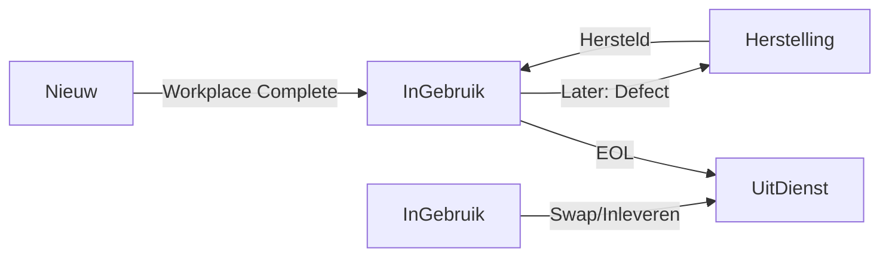

# Rollout Workflow - Gebruikersgids

**Versie**: 1.0
**Laatst Bijgewerkt**: 14 maart 2026

## Inhoudsopgave

1. [Overzicht](#overzicht)
2. [Workflow Stappen](#workflow-stappen)
3. [Werkplek Configuratie - De Drie Regio's](#werkplek-configuratie)
4. [Asset Status Flow](#asset-status-flow)
5. [Veelgestelde Vragen](#veelgestelde-vragen)

---

## Overzicht

De Rollout Workflow is een gestructureerd proces voor het plannen, uitvoeren en rapporteren van IT-asset rollouts. Het systeem ondersteunt:

- **Planning**: Sessies aanmaken, dagen plannen, werkplekken configureren
- **Uitvoering**: Stap-voor-stap installatie met real-time tracking
- **Rapportage**: Overzichten en statistieken van voltooide rollouts

### Hiërarchie

```
RolloutSession (Rollout Project)
  ├── RolloutDay 1 (Dag in planning)
  │     ├── Workplace 1 (Werkplek gebruiker)
  │     ├── Workplace 2
  │     └── Workplace 3
  ├── RolloutDay 2
  │     └── ...
  └── RolloutDay 3
```

---

## Workflow Stappen

### Stap 1: Sessie Aanmaken (RolloutListPage)

**Doel**: Een nieuwe rollout sessie starten

**Acties**:
1. Navigeer naar "Rollouts" in het hoofdmenu
2. Klik op "+ Nieuwe Rollout"
3. Vul in:
   - Sessienaam (bv. "Q1 2026 Laptop Refresh")
   - Omschrijving (optioneel)
   - Geplande startdatum
   - Geplande einddatum
4. Klik "Opslaan"

**Resultaat**: Nieuwe sessie met status "Planning"

---

### Stap 2: Dagen Toevoegen (RolloutPlannerPage)

**Doel**: Rollout opdelen in uitvoerbare dagen

**Acties**:
1. Open de sessie (klik op naam in lijst)
2. Klik "+ Nieuwe Dag"
3. Vul in:
   - Datum (wanneer deze dag uitgevoerd wordt)
   - Naam (bv. "Dienst ICT - Kantoor")
   - Dagnummer (automatisch: 1, 2, 3...)
   - Geplande diensten (filter voor werkplekken)
   - Notities (optioneel)
4. Klik "Opslaan"

**Resultaat**: Dag toegevoegd met status "Planning"

**Tip**: Gebruik het filtermenu om dagen te sorteren op datum of status.

---

### Stap 3: Werkplekken Configureren

Werkplekken kunnen op drie manieren worden toegevoegd:

#### Optie A: Handmatig Toevoegen
1. Open een dag (klik op de dag in de lijst)
2. Klik "+ Nieuwe Werkplek"
3. Vul gebruikersinformatie in:
   - Naam gebruiker
   - E-mailadres (optioneel)
   - Locatie (optioneel)
   - Dienst
4. Configureer assets via de **drie regio's** (zie hieronder)
5. Klik "Opslaan"

#### Optie B: Bulk Import vanuit Azure AD
1. Klik "Bulk Import"
2. Selecteer bron:
   - **Dienst**: Kies een MG-* groep
   - **Sector**: Kies een MG-SECTOR-* groep
   - **Afdeling**: Kies een afdeling uit Azure AD
3. Selecteer gebruikers (of kies "Selecteer alles")
4. Configureer standaard asset template
5. Klik "Importeer Werkplekken"

**Resultaat**: Meerdere werkplekken aangemaakt met standaard configuratie

#### Optie C: Bulk Aanmaak (Lege Werkplekken)
1. Klik "Bulk Toevoegen"
2. Vul in:
   - Aantal werkplekken
   - Standaard dienst
   - Asset template (laptop, monitors, etc.)
3. Klik "Aanmaken"

**Resultaat**: Lege werkplekken met standaard configuratie (later in te vullen)

---

## Werkplek Configuratie

Elke werkplek heeft een **Asset Plan** met drie functionele regio's:

### Regio 1: Update Assets (Bestaande Assets Bijwerken)

**Gebruik**: Wanneer een gebruiker al assets heeft in het systeem

**Functionaliteit**:
- Zoek bestaande assets op serienummer
- Koppel assets aan deze werkplek
- Update asset informatie (eigenaar, locatie)

**Voorbeeld Flow**:
1. Scan serienummer van laptop (bv. ABC123456)
2. Systeem zoekt asset in database
3. Als gevonden: asset wordt gekoppeld
4. Als niet gevonden: optie om nieuw asset aan te maken

**Asset Status**: Blijft ongewijzigd (meestal "InGebruik")

---

### Regio 2: Swap/Inleveren (Oude Apparatuur Ophalen)

**Gebruik**: Wanneer oude apparatuur wordt vervangen

**Functionaliteit**:
- Registreer oude asset die wordt ingeleverd
- Koppel oude asset aan werkplek
- Bij voltooien: oude asset → status "UitDienst"

**Voorbeeld Flow**:
1. Gebruiker levert oude laptop in (serienummer XYZ789)
2. Scan serienummer
3. Systeem markeert asset als "oude asset"
4. Bij completion: XYZ789 → UitDienst

**Asset Status Transitie**:
```
InGebruik → UitDienst (bij workplace completion)
```

---

### Regio 3: Nieuw Toevoegen (Nieuwe Assets Aanmaken)

**Gebruik**: Wanneer nieuwe apparatuur wordt uitgeleverd

**Functionaliteit**:
- Maak nieuwe assets aan voor deze werkplek
- Selecteer templates (laptop, docking, monitor, keyboard, mouse)
- Genereer QR codes voor nieuwe assets
- Bij voltooien: nieuwe asset → status "InGebruik"

**Voorbeeld Flow**:
1. Selecteer template "Standaard Kantoorwerkplek":
   - 1x Laptop
   - 1x Docking Station
   - 2x Monitor
   - 1x Keyboard
   - 1x Mouse
2. Vul brand/model in voor elk item
3. Scan serienummers tijdens uitvoering
4. Systeem maakt assets aan met QR codes

**Asset Status Transitie**:
```
Nieuw (aangemaakt) → InGebruik (bij workplace completion)
```

**QR Code Generatie**:
- Automatisch voor nieuwe assets
- Download beschikbaar via "QR Codes Afdrukken"
- Formaat: `{AssetCode}-QR.svg`

---

## Asset Status Flow

### Rollout-Specifieke Status Transities



### Status Betekenis in Rollout Context

| Status | Wanneer | Actie |
|--------|---------|-------|
| **Nieuw** | Asset aangemaakt tijdens planning | Nog niet in gebruik |
| **InGebruik** | Na workplace completion | Bij gebruiker geïnstalleerd |
| **UitDienst** | Oude asset ingeleverd | Uit circulatie |
| **Herstelling** | (Niet in rollout) | Defect apparaat in repair |

### Transactionele Integriteit

Bij het voltooien van een werkplek gebeurt het volgende **atomically** (all-or-nothing):

1. Nieuwe assets: Nieuw → InGebruik
2. Nieuwe assets: Owner = gebruikersnaam
3. Nieuwe assets: InstallationDate = nu
4. Oude assets: InGebruik → UitDienst
5. Workplace: status = Completed
6. Day: CompletedWorkplaces += 1

Als één stap faalt, wordt **alles teruggedraaid** (rollback).

---

## Stap 4: Uitvoering (RolloutExecutionPage)

**Doel**: Werkplekken één voor één installeren

**Acties**:
1. Navigeer naar de dag
2. Klik "Start Uitvoering"
3. Voor elke werkplek:
   - Klik "Start" op werkplek
   - Scan/voer serienummers in voor elk asset item
   - Klik "Geïnstalleerd" of "Overgeslagen" per item
   - Klik "Werkplek Voltooien" als alles klaar is
4. Herhaal voor alle werkplekken

**Real-Time Updates**:
- Status badges kleuren mee (grijs → blauw → groen)
- Progress bar per werkplek (0/5 → 5/5)
- Day progress (0/10 → 10/10 workplaces)

**Foutafhandeling**:
- Als serienummer niet gevonden: optie om nieuw asset aan te maken
- Als item overgeslagen: status blijft "skipped" (wordt niet meegeteld)
- Als voltooien faalt: error melding + rollback

---

## Stap 5: Rapportage (RolloutReportPage)

**Doel**: Overzicht en statistieken van voltooide sessie

**Beschikbare Informatie**:
- Totaal aantal dagen en werkplekken
- Completion percentage per dag
- Asset type breakdown (hoeveel laptops, monitors, etc.)
- Tijdlijn van uitvoering
- Export naar CSV/Excel (optioneel)

**Acties**:
1. Open voltooide sessie
2. Klik "Rapportage"
3. Bekijk statistieken
4. Download rapport (optioneel)

---

## Werkplek Status Transities

```
Pending → Ready → InProgress → Completed
   ↓         ↓          ↓
 (Planning) (Approved) (Executing)
```

| Status | Betekenis | Acties Mogelijk |
|--------|-----------|-----------------|
| **Pending** | Werkplek aangemaakt, nog niet goedgekeurd | Bewerken, Verwijderen |
| **Ready** | Goedgekeurd voor uitvoering | Starten, Bewerken |
| **InProgress** | Bezig met installatie | Items scannen, Voltooien |
| **Completed** | Alle items geïnstalleerd | Heropenen (optioneel) |

**Status Transitie Regels**:
- Pending → Ready: handmatige actie "Markeer als Klaar"
- Ready → InProgress: automatisch bij eerste item scan
- InProgress → Completed: handmatige actie "Werkplek Voltooien"
- Completed → InProgress: handmatige actie "Heropenen" (met optie om asset transities te reverteren)

---

## Veelgestelde Vragen

### Wat gebeurt er als ik een werkplek heropen?

**Antwoord**: De werkplek status gaat terug naar "InProgress". Je hebt twee opties:

1. **Zonder Asset Reversal**: Alleen status wijzigt, assets blijven "InGebruik"
2. **Met Asset Reversal**: Assets keren terug naar vorige status:
   - InGebruik → Nieuw (nieuwe assets)
   - UitDienst → InGebruik (oude assets)

**Gebruik Case**: Je hebt per ongeluk een verkeerde werkplek voltooid.

---

### Kan ik een werkplek verwijderen na completion?

**Antwoord**: Nee, voltooide werkplekken kunnen niet worden verwijderd (data integriteit).
Je kunt alleen heropenen en opnieuw voltooien met correcte data.

---

### Wat gebeurt er met QR codes voor nieuwe assets?

**Antwoord**:
- QR codes worden automatisch gegenereerd bij asset aanmaak
- Download via "QR Codes Afdrukken" in planning overzicht
- Formaat: SVG (schaalbaar voor printen)
- Bestandsnaam: `{AssetCode}-QR.svg` (bv. `LAP-DELL-2026-0042-QR.svg`)

**Tip**: Print alle QR codes voor een dag in één keer via de bulk print functie.

---

### Kan ik een dag verwijderen als er werkplekken in zitten?

**Antwoord**: Ja, maar alleen als:
1. De dag status is "Planning" (niet Ready of Completed)
2. Alle werkplekken status is "Pending" (niet InProgress of Completed)

**Cascade Delete**: Alle werkplekken in de dag worden ook verwijderd.

---

### Hoe werkt de serienummer scan functie?

**Antwoord**:
1. Focus op het serienummer veld
2. Scan met barcode scanner (of typ handmatig)
3. Systeem zoekt automatisch na 500ms (debounce)
4. Als gevonden: asset details worden getoond
5. Als niet gevonden: optie om nieuw asset aan te maken

**Debounce**: Voorkomt onnodige API calls tijdens typen.

---

### Wat is het verschil tussen "Overgeslagen" en "Niet Geïnstalleerd"?

**Antwoord**:
- **Overgeslagen**: Bewuste keuze om item niet te installeren (telt mee als voltooid)
- **Niet Geïnstalleerd**: Status "pending", werkplek kan nog niet worden voltooid

**Voorbeeld**: Gebruiker heeft al een eigen keyboard → klik "Overslaan" op keyboard item.

---

### Kan ik de volgorde van dagen wijzigen?

**Antwoord**: Nee, dagen worden automatisch gesorteerd op:
1. Datum (oplopend)
2. DayNumber (oplopend)

**Tip**: Gebruik duidelijke namen en data voor overzichtelijke planning.

---

### Hoe weet ik welke werkplekken al voltoo zijn?

**Antwoord**: Gebruik de status filter in planning overzicht:
- **Alle**: Toon alle werkplekken
- **Voltooid**: Alleen completed workplaces
- **In Uitvoering**: Alleen InProgress workplaces
- **Nog Te Doen**: Pending + Ready workplaces

**Visuele Indicatoren**:
- 🟢 Groen badge: Completed
- 🔵 Blauw badge: InProgress
- ⚪ Grijs badge: Pending/Ready

---

## Technische Details

### Backend Endpoints

```
GET    /api/rollouts                    - Lijst alle sessies
POST   /api/rollouts                    - Maak sessie
GET    /api/rollouts/{id}               - Haal sessie op
PUT    /api/rollouts/{id}               - Update sessie
DELETE /api/rollouts/{id}               - Verwijder sessie

GET    /api/rollouts/{id}/days          - Lijst dagen voor sessie
POST   /api/rollouts/{id}/days          - Maak dag
GET    /api/rollouts/days/{dayId}       - Haal dag op
PUT    /api/rollouts/days/{dayId}       - Update dag
DELETE /api/rollouts/days/{dayId}       - Verwijder dag

GET    /api/rollouts/days/{dayId}/workplaces - Lijst werkplekken voor dag
POST   /api/rollouts/days/{dayId}/workplaces - Maak werkplek
GET    /api/rollouts/workplaces/{id}         - Haal werkplek op
PUT    /api/rollouts/workplaces/{id}         - Update werkplek
DELETE /api/rollouts/workplaces/{id}         - Verwijder werkplek

POST   /api/rollouts/workplaces/{id}/start    - Start werkplek uitvoering
POST   /api/rollouts/workplaces/{id}/complete - Voltooi werkplek
POST   /api/rollouts/workplaces/{id}/reopen   - Heropen werkplek

GET    /api/rollouts/{id}/progress - Haal progress statistieken
```

### Database Schema

```sql
-- RolloutSession table
CREATE TABLE RolloutSessions (
    Id INT PRIMARY KEY,
    SessionName NVARCHAR(200),
    Description NVARCHAR(MAX),
    Status INT, -- Enum: Planning, Ready, InProgress, Completed
    PlannedStartDate DATETIME2,
    PlannedEndDate DATETIME2,
    CreatedBy NVARCHAR(200),
    CreatedAt DATETIME2,
    UpdatedAt DATETIME2
);

-- RolloutDay table
CREATE TABLE RolloutDays (
    Id INT PRIMARY KEY,
    RolloutSessionId INT FOREIGN KEY,
    Date DATETIME2,
    Name NVARCHAR(200),
    DayNumber INT,
    Status INT, -- Enum: Planning, Ready, Completed
    TotalWorkplaces INT,
    CompletedWorkplaces INT,
    CreatedAt DATETIME2,
    UpdatedAt DATETIME2
);

-- RolloutWorkplace table
CREATE TABLE RolloutWorkplaces (
    Id INT PRIMARY KEY,
    RolloutDayId INT FOREIGN KEY,
    UserName NVARCHAR(200),
    UserEmail NVARCHAR(200),
    Location NVARCHAR(200),
    ServiceId INT FOREIGN KEY,
    AssetPlansJson NVARCHAR(MAX), -- JSON array van AssetPlan objecten
    Status INT, -- Enum: Pending, Ready, InProgress, Completed
    TotalItems INT,
    CompletedItems INT,
    CompletedAt DATETIME2,
    CompletedBy NVARCHAR(200),
    CreatedAt DATETIME2,
    UpdatedAt DATETIME2
);
```

### AssetPlan JSON Structure

```typescript
interface AssetPlan {
  equipmentType: 'laptop' | 'desktop' | 'docking' | 'monitor' | 'keyboard' | 'mouse';
  createNew: boolean; // true = create new asset, false = link existing
  requiresSerialNumber: boolean;
  requiresQRCode: boolean;
  status: 'pending' | 'installed' | 'skipped';

  // Optionele velden (gevuld tijdens uitvoering)
  brand?: string;
  model?: string;
  existingAssetId?: number; // Link naar bestaand asset
  existingAssetCode?: string;
  oldAssetId?: number; // Asset dat wordt vervangen
  oldAssetCode?: string;

  // Metadata
  metadata: {
    position?: 'left' | 'center' | 'right'; // Voor monitors
    hasCamera?: 'true' | 'false'; // Voor monitors
    serialNumber?: string; // Serienummer
    [key: string]: string; // Extra metadata
  };
}
```

### React Query Cache Keys

```typescript
const rolloutKeys = {
  all: ['rollouts'],
  sessions: () => ['rollouts', 'sessions'],
  session: (id) => ['rollouts', 'session', id],
  days: (sessionId) => ['rollouts', 'days', sessionId],
  day: (dayId) => ['rollouts', 'day', dayId],
  workplaces: (dayId) => ['rollouts', 'workplaces', dayId],
  workplace: (workplaceId) => ['rollouts', 'workplace', workplaceId],
  progress: (sessionId) => ['rollouts', 'progress', sessionId],
  newAssets: (dayId) => ['rollouts', 'newAssets', dayId],
};
```

---

## Support & Contact

Voor technische vragen of bugs:
- **Email**: jo.wijnen@diepenbeek.be
- **GitHub**: https://github.com/Djoppie/Djoppie-Inventory

Voor feature requests:
- Maak een issue aan in de GitHub repository

---

**Document Versie**: 1.0
**Laatste Update**: 14 maart 2026
**Auteur**: Claude Code (Project Coordinator)
**Review Status**: Approved
